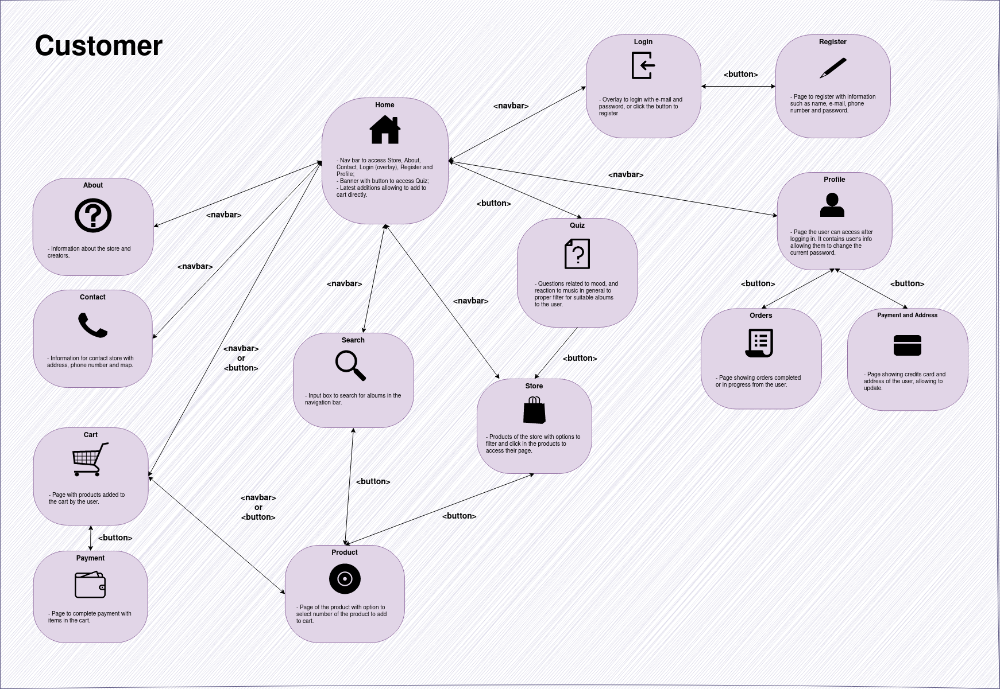
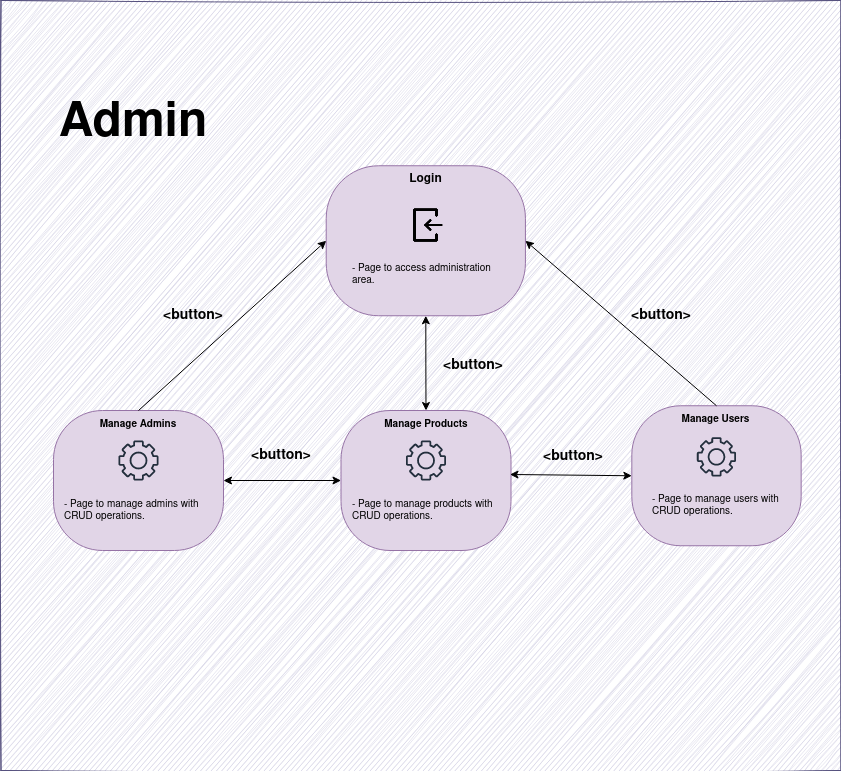

# Sound Chaser Store

<p align="center">

</p>

---

*Sound Chaser is a fictitious vinyl record store specialized in rock and jazz music albums created for the course SCC0219 - Introduction to Web Development at the Instituto de Ciências Matemáticas e de Computação (ICMC) - USP.*

**Members (Group 29):**

Breno Lívio Silva de Almeida, NUSP: 10276675.

---

## Summary 

- [1. System Requirements](#1)

    - [1.1. Overview](#1.1)

    - [1.2. Data Records](#1.2)

    - [1.3. Extra Functionalities](#1.3)

- [2. Project Description](#2)

    - [2.1. Mockups](#2.1)

    - [2.2. Navigation Diagram](#2.2)

- [3. Comments About the Code](#3)

    - [3.1. Milestone 1](#3.1)

    - [3.2. Milestone 2](#3.2)

- [4. Test Procedures](#4)

    - [4.1. Test Plan](#4.1)

    - [4.2. Test Results](#4.2)

- [5. Build Procedures](#5)

- [6. Problems](#6)

- [7. Comments](#7)

---

## <a id="1" /> 1. System Requirements

### <a id="1.1" /> 1.1. Overview

- The system has 2 types of users: Clients and Administrators

    - Administrators are responsible for registering/managing administrators, customers, and products/services provided. The application already comes with an account `admin` with the password `admin`.
    
    - Customers are users who access the system to buy products/services.

- The system uses the traditional cart logic to make sales

    - The logged-in user can add/remove items from the cart.

    - The purchase can be completed after the customer confirms/adds the delivery address and the credit card.

    - The cart is emptied when a purchase is completed.

###  <a id="1.2" /> 1.2. Data Records

- Admin:
    - `id`: Identification number;
    - `name`: Admin's name;
    - `email`: Admin's e-mail;
    - `phone`: Admin's phone number;
    - `password`: Admin's password.

- Product:
    - `id`: Identification number;
    - `name`: Album's name;
    - `artist`: Album's artist name;
    - `year`: Album's year;
    - `genre`: Album's genre;
    - `description`: Album's description;
    - `price`: Album's price;
    - `stock`: In stock quantity;
    - `sold`: Number sold;
    - `date_added`: Date album was added to the records.

- Customer:
    - `id`: Identification number;
    - `name`: Customer's name;
    - `email`: Customer's e-mail;
    - `password`: Customer's password.
    - `phone`: Customer's phone number;
    - `address`: Customer's address;
    - `orders`: Customer's multiple orders;
    - `card`: Customer's credit card;
    - `cart`: Customer's cart items;

### <a id="1.3" /> 1.3. Extra Functionalities

**Quiz to filter for the most suitable albums for customers:**

Music is a highly subjective and emotional experience, and different people have varying tastes and preferences. By taking into account the customer's mood, the significance of lyrics to them, and other aspects, the quiz can provide personalized recommendations and ensure that the customers purchase albums that resonate with them. It can also help customers discover new artists and genres that align with their musical preferences. Overall, the quiz can enhance the customer's shopping experience, provide a more personalized service, and increase the likelihood of repeat business for the record store.

**Filtering and sorting:**

The user have also the options to sort by the date added the albums were added, artist name, album name, and album year, alongside with filter for specific genres, price and album year ranges. 

## <a id="2" /> 2. Project Description

This project consists in developing an online application for a vinyl record store specializing in rock and jazz music, which will have the following functionalities:

- Registration and Login

- Add or remove products from the cart
    
- Checkout process
    
- Product search filters
    
- Customer and product management options exclusive to system administrators
    
- Specific functionalities: The website has a specific feature where customers can take a quiz that filters the most suitable albums for them. The quiz asks them to rate certain characteristics on a scale of 1 to 5, such as their current mood, the importance of song lyrics to them, their comfort level with longer songs, their tendency to dance to music, and their preference for virtuoso artists. The site has also many option to sort the albums, filter by genre and range of price and year the albums were released.

### <a id="2.1" /> 2.1. Mockups

Mockups for the online record store can be found here: [Figma](https://www.figma.com/file/3NG7gNkuU3mJkgFEOOjkbA/Sound-Chaser---Web-Page?node-id=0%3A1&t=57xBtVx9HQDN2bnt-1)

The following Figma Prototype can be used to interact with the screens created (as a customer or administrator): [Prototype](https://www.figma.com/proto/3NG7gNkuU3mJkgFEOOjkbA/Sound-Chaser---Web-Page?node-id=2-5&scaling=min-zoom&page-id=0%3A1&starting-point-node-id=2%3A5&show-proto-sidebar=1)

Several HTML5/CSS3 files were created considering the project requirements and mockups.

### <a id="2.2" /> 2.2. Navigation Diagram

We created the following navigation diagrams considering how the application will work with separate interfaces for the customer and administrators:





Considering how the navigation bar is presented, we have bidirectional navigation occurring throughout the application (i.e. we can go back and forth in these portions).

## <a id="3" /> 3. Comments About the Code


### <a id="3.1" /> 3.1. Milestone 1

For the first milestone, we created several HTML5/CSS3 files to develop the screens for the Single Page Application (SPA). 

To properly adapt to different devices of different sizes, we adopted [viewport units](https://web.dev/viewport-units/) for the proper scaling of objects with CSS.

Also, JavaScript was only used for login form overlay.

### <a id="3.2" /> 3.2. Milestone 2

The application was developed utilizing the React framework for the front-end implementation. The development process involved meticulous organization of the codebase into modular components, adhering to best practices for code structuring and maintainability. Additionally, the user interface design was carefully crafted to ensure a visually appealing and intuitive user experience.

## <a id="4" /> 4. Test Procedures

Manual tests will be performed for login and registration, insertions and management of products, users, filtering, searching, and also simulation of purchases in various scenarios. For Milestone 2, only client-side tests are considered. No additional frameworks will be used for the tests.

### <a id="4.1" /> 4.1. Test Plan

- Registration test

    - Registration made with name less than 5 or more than 32 characters;

    - Registration made with invalid email;

    - Registration made with phone number using characters that are not digits;
    
    - Registration where the password has less than 8 or more than 32 characters;
    
    - Registration where the password field does not match the password confirmation field;

    - Registration using the same e-mail as a previous registration;

    - Registration correctly filled with valid data.

- Login test

    - Login made with empty fields;

    - Login made with invalid fields;

    - Login made with fields correctly filled out.

- Search test

    - Search with white spaces;

    - Search with "Kilometers Davis" or "kilometers";

    - Search with "villains".

- Filter and sort test

    - Sort by artist name while filtering for classic rock genre;

    - Sort by album year while filtering for pop and rap genres;

    - Sort by artist name while filtering for jazz and classical music genres, setting price range between 20 and 50;

    - Sort by album name while filtering for progressive rock and alternative rock genres, setting year range to 2000 as max.

- Navigation test

    - User not logged in navigating the page;

    - User enter a invalid page for the application;

    - Customer navigation between pages.

- Adding to cart test

    - Adding product to cart while user is not logged in;

    - Adding product to cart while user is logged in and have the same item in the cart;

    - Adding product while user is logged in and doesn't have item in the cart.

- Cart test

    - Proceed to payment with no items;

    - Proceed to payment with items;

    - Buy without having registered the address;

    - Buy without having registered the credit card;

    - Buy after providing address and card information in the user area.

- User information area

    - Update to name less than 5 or more than 32 characters;

    - Update to invalid email;

    - Update to phone number using characters that are not digits;
    
    - Update to password less than 8 or more than 32 characters;

    - Input wrong current password;
    
    - Update password when password field does not match the password confirmation field;

    - Update using the same e-mail as a previous registration;

    - Saving correctly filled with valid data.

- User payment and address area

    - Add/update to card less than 8 or more than 16 digits;

    - Holder name less 5 and more than 32 characters;

    - Expiration date not properly formatted;
    
    - Security code being different from 3 digits;

    - Address less than 20 or more than 128 characters;
    
    - Receiver less 5 and more than 32 characters;

    - Saving correctly filled with valid data.

- Admin area

    - Visualize and remove admins in the site;

    - Visualize and remove albums in the admin area;

    - Visualize and remove users in the admin area.


### <a id="4.2" /> 4.2. Test Results

After carefully following the test plan, we had the following results:

- Registration test

    - **Registration made with name less than 5 or more than 32 characters**: The website will emit an alert indicating that the name must be between 5 and 32 characters long.
    
    - **Registration made with invalid email**: The website will emit an alert indicating that the email provided is invalid.
    
    - **Registration made with phone number using characters that are not digits**: The website will emit an alert indicating that the phone number should only contain digits.
    
    - **Registration where the password has less than 8 or more than 32 characters**: The website will emit an alert indicating that the password must be between 8 and 32 characters long.
    
    - **Registration where the password field does not match the password confirmation field**: The website will emit an alert indicating that the password and password confirmation fields do not match.
    
    - **Registration using the same e-mail as a previous registration**: The website will emit an alert indicating that the email has already been used for registration.
    
    - **Registration correctly filled with valid data**: The registration will proceed successfully without emitting any alerts.

- Login test

    - **Login made with empty fields**: The website will emit an alert indicating that both the email and password fields are required.
    
    - **Login made with invalid fields**: The website will emit an alert indicating that the login credentials are invalid.
    
    - **Login made with fields correctly filled out**: The login will proceed successfully without emitting any alerts.

- Search test

    - **Search with white spaces**: The filter won't be aplied.
    
    - **Search with "Kilometers Davis" or "kilometers"**: The same album is shown.
    
    - **Search with "villains" or "david**: The same album is shown.

- Filter and sort test

    - **Sort by artist name while filtering for classic rock genre**: Three albums are shown, sorting sucessfully.
    
    - **Sort by album year while filtering for pop and rap genres**: Four albums are shown, sorting sucessfully.
    
    - **Sort by artist name while filtering for jazz and classical music genres, setting price range between 20 and 50**: Only one album is shown, sorting and setting range sucessfully.
    
    - **Sort by album name while filtering for progressive rock and alternative rock genres, setting year range to 2000 as max**: Three albums are shown, sorting and setting range sucessfully.

- Navigation test

    - **User not logged in navigating the page**: After clicking the cart, it is shown the login form.

    - **User enter a invalid page for the application:** They are redirected to the home page.

    - **Customer navigation between pages**: No alert are emitted.

- Adding to cart test

    - **Adding product to cart while user is not logged in**: The website will emit an alert indicating that the user needs to be logged in to add items to the cart.
    
    - **Adding product to cart while user is logged in and have the same item in the cart**: The website will emit an alert indicating that the item is already in the cart.
    
    - **Adding product while user is logged in and doesn't have item in the cart**: The product will be added to the cart successfully without emitting any alerts and redirect the user to the cart.

- Cart test

    - **Proceed to payment with no items**: The website will emit an alert indicating that there are no items in the cart and the user cannot proceed to payment.
    
    - **Proceed to payment with items**: The user will be able to proceed to payment without emitting any alerts.
    
    - **Buy without having registered the address or cart**: The website will emit an alert indicating that the user needs to provide a valid address and card before proceeding with the purchase.
    
    - **Buy after providing address and card information in the user area**: The purchase will proceed successfully without emitting any alerts.

- User information area

    - **Update to name less than 5 or more than 32 characters**: The website will emit an alert indicating that the name must be between 5 and 32 characters long.
    
    - **Update to invalid e-mail**: The website will emit an alert indicating that the e-mail provided is invalid.
    
    - **Update to phone number using characters that are not digits**: The website will emit an alert indicating that the phone number should only contain digits.
    
    - **Update to password less than 8 or more than 32 characters**: The website will emit an alert indicating that the password must be between 8 and 32 characters long.
    
    - **Input wrong current password**: The website will emit an alert indicating that the current password provided is incorrect.
    
    - **Update password when password field does not match the password confirmation field**: The website will emit an alert indicating that the password and password confirmation fields do not match.
    
    - **Update using the same e-mail as a previous registration**: The website will emit an alert indicating that the email has already been used for registration.
    
    - **Saving correctly filled with valid data**: The user information will be saved successfully without emitting any alerts.

- User payment and address area

    - **Add/update to card less than 8 or more than 16 digits**: The website will emit an alert indicating that the card number must be between 8 and 16 digits long.
    
    - **Holder name less 5 and more than 32 characters**: The website will emit an alert indicating that the holder name must be between 5 and 32 characters long.
    
    - **Expiration date not properly formatted**: The website will emit an alert indicating that the expiration date should be properly formatted.
    
    - **Security code being different from 3 digits**: The website will emit an alert indicating that the security code should be 3 digits long.
    
    - **Address less than 20 or more than 128 characters**: The website will emit an alert indicating that the address must be between 20 and 128 characters long.
    
    - **Receiver less 5 and more than 32 characters**: The website will emit an alert indicating that the receiver name must be between 5 and 32 characters long.
    
    - **Saving correctly filled with valid data**: The payment and address information will be saved successfully without emitting any alerts.

- Admin area

    - **Create admins in the admin area**: Admins can successfully create admins putting valid name, e-mail, phone and password.

    - **Create products in the admin area**: Admins can successfully create products putting valid image, name, artist, year, genre, description, price, stock and number sold.

    - **Create users in the admin area**: Admins can successfully create users putting valid name, e-mail, phone and password.

    - **Read/Edit admins in the admin area**: Admins can successfully read and edit admins putting valid name, e-mail, phone and password.

    - **Read/Edit products in the admin area**: Admins can successfully read and edit products putting valid image, name, artist, year, genre, description, price, stock and number sold.

    - **Read/Edit users in the admin area**: Admins can successfully read and edit users putting valid name, e-mail, phone and password.

    - **Remove admins in the admin area**: Admins can successfully remove admins except for themselves and the main admin.

    - **Remove products in the admin area**: Admins can successfully remove products.

    - **Remove users in the admin area**: Admins can successfully remove users.

## <a id="5" /> 5. Build Procedures

To be able to run the site you need to have Node and its package manager npm installed, with json-server to properly load the JSON mock objects (which you can install with `npm install json-server`). After this, inside the `frontend` directory, use the following command:

```bash
npm install
```

Run the back-end with json-server:

```bash
npm run backend
```

Finally, run the front-end in another terminal:

```bash
npm start
```

An user example you can use to access the site:

`E-mail: antedeguemon@tutamail.com`, `Password: password`

An admin example you can use to access the administration area in `http://localhost:3000/admin`:

`E-mail: admin@soundchaser.com`, `Password: password`


## <a id="6" /> 6. Problems

No major problems were encountered.

## <a id="7" /> 7. Comments

Milestone 1 played a pivotal role in establishing the fundamental elements of the application, with a specific emphasis on HTML5 and CSS3 development. This initial milestone was crucial in laying the groundwork for subsequent milestones, particularly Milestone 2. In Milestone 2, we leveraged the pages created in the prior stage to construct a cohesive single-page application (SPA) within the context of contemporary web development frameworks. This milestone served to illuminate the significance of the Virtual DOM, a powerful concept that facilitates efficient rendering and updates within React applications. By delving into the Virtual DOM, we gained a deeper understanding of its integral role in optimizing the performance and responsiveness of the application.