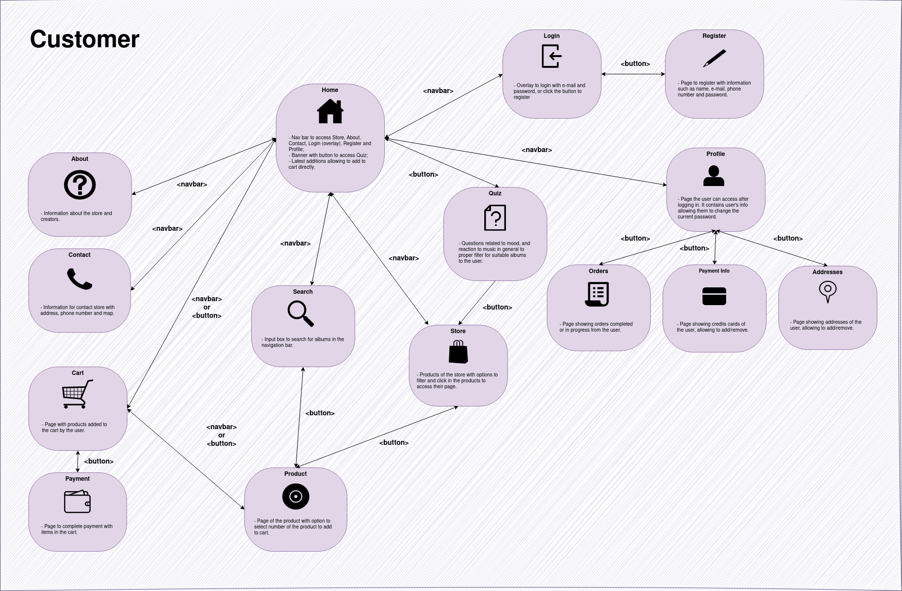
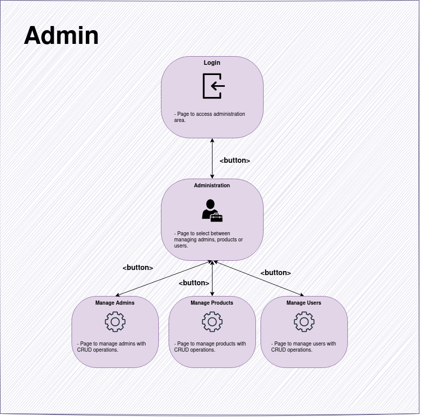

# Sound Chaser Store

---

*Sound Chaser is a fictitious vinyl record store specialized in rock and jazz music albums created for the course SCC0219 - Introduction to Web Development at the Instituto de Ciências Matemáticas e de Computação (ICMC) - USP.*

**Members (Group 29):**

Breno Lívio Silva de Almeida, NUSP: 10276675.

---

## Summary 

- [1. System Requirements](#1)

    - [1.1. Overview](#1.1)

    - [1.2. Data Records](#1.2)

    - [1.3. Extra Functionality](#1.3)

- [2. Project Description](#2)

    - [2.1. Mockups](#2.1)

    - [2.2. Navigation Diagram](#2.2)

- [3. Comments About the Code](#3)

    - [3.1. Milestone 1](#3.1)
---

## <a id="1" /> 1. System Requirements

### <a id="1.1" /> 1.1. Overview

- The system has 2 types of users: Clients and Administrators

    - Administrators are responsible for registering/managing administrators, customers, and products/services provided. The application already comes with an account `admin` with the password `admin`.
    
    - Customers are users who access the system to buy products/services.

- The system uses the traditional cart logic to make sales

    - The logged-in user can add/remove items from the cart.

    - The purchase can be completed after the customer confirms/adds the delivery address and the credit card.

    - The cart is emptied when a purchase is completed.

###  <a id="1.2" /> 1.2. Data Records

- Admin:
    - `id`: Identification number;
    - `name`: Admin's name;
    - `email`: Admin's e-mail;
    - `phone`: Admin's phone number;
    - `password`: Admin's password.

- Product:
    - `id`: Identification number;
    - `name`: Album's name;
    - `artist`: Album's artist name;
    - `year`: Album's year;
    - `genre`: Album's genre;
    - `description`: Album's description;
    - `price`: Album's price;
    - `stock`: In stock quantity;
    - `sold`: Number sold;
    - `date_added`: Date album was added to the records.

- Customer:
    - `id`: Identification number;
    - `name`: Customer's name;
    - `email`: Customer's e-mail;
    - `phone`: Customer's phone number;
    - `addresses`: Customer's multiple addresses;
    - `orders`: Customer's multiple orders;
    - `cards`: Customer's multiple credit cards;
    - `password`: Customer's password.

### <a id="1.3" /> 1.3. Extra Functionality

**Quiz to filter for the most suitable albums for customers:**

Music is a highly subjective and emotional experience, and different people have varying tastes and preferences. By taking into account the customer's mood, the significance of lyrics to them, and other aspects, the quiz can provide personalized recommendations and ensure that the customers purchase albums that resonate with them. It can also help customers discover new artists and genres that align with their musical preferences. Overall, the quiz can enhance the customer's shopping experience, provide a more personalized service, and increase the likelihood of repeat business for the record store.

## <a id="2" /> 2. Project Description

This project consists in developing an online application for a vinyl record store specializing in rock and jazz music, which will have the following functionalities:

- Registration and Login

- Add or remove products from the cart
    
- Checkout process
    
- Product search filters
    
- Customer and product management options exclusive to system administrators
    
- Specific functionality: The website has a specific feature where customers can take a quiz that filters the most suitable albums for them. The quiz asks them to rate certain characteristics on a scale of 1 to 5, such as their current mood, the importance of song lyrics to them, their comfort level with longer songs, their tendency to dance to music, and their preference for virtuoso artists.

### <a id="2.1" /> 2.1. Mockups

Mockups for the online record store can be found here: [Figma](https://www.figma.com/file/3NG7gNkuU3mJkgFEOOjkbA/Sound-Chaser---Web-Page?node-id=0%3A1&t=57xBtVx9HQDN2bnt-1)

The following Figma Prototype can be used to interact with the screens created (as a customer or administrator): [Prototype](https://www.figma.com/proto/3NG7gNkuU3mJkgFEOOjkbA/Sound-Chaser---Web-Page?node-id=2-5&scaling=min-zoom&page-id=0%3A1&starting-point-node-id=2%3A5&show-proto-sidebar=1)

Several HTML5/CSS3 files were created considering the project requirements and mockups.

### <a id="2.2" /> 2.2. Navigation Diagram

We created the following navigation diagrams considering how the application will work with separate interfaces for the customer and administrators:

Considering how the navigation bar is presented, we have bidirectional navigation occurring throughout the application (i.e. we can go back and forth in these portions).

## <a id="3" /> 3. Comments About the Code

### <a id="3.1" /> 3.1. Milestone 1

For the first milestone, we created several HTML5/CSS3 files to develop the screens for the Single Page Application (SPA). 

To properly adapt to different devices of different sizes, we adopted [viewport units](https://web.dev/viewport-units/) for the proper scaling of objects with CSS.